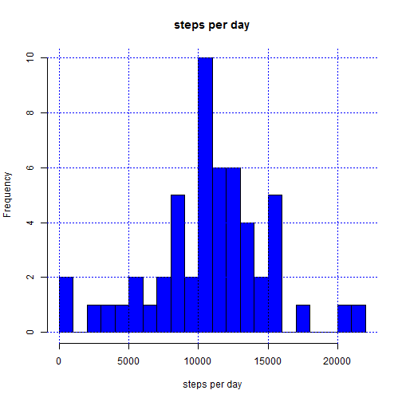
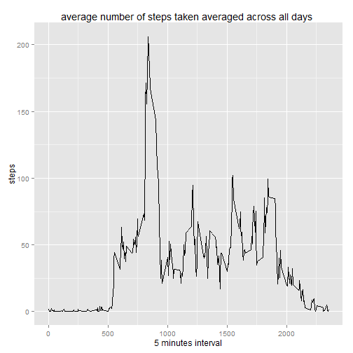
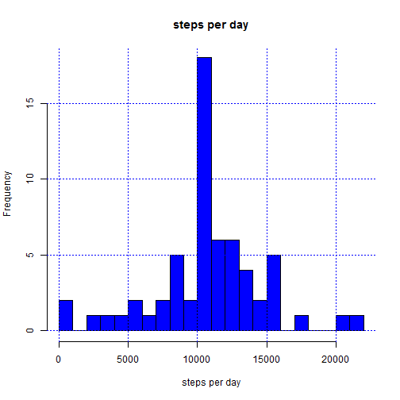
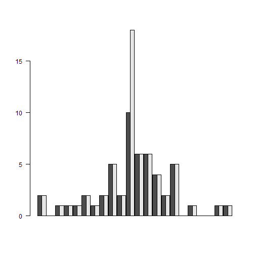
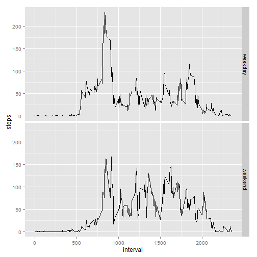

##Introduction

    It is now possible to collect a large amount of data about personal movement
    using activity monitoring devices such as a Fitbit, Nike Fuelband, or 
    Jawbone Up. These type of devices are part of the 'quantified self' movement
    ; a group of enthusiasts who take measurements about themselves regularly to
    improve their health, to find patterns in their behavior, or because they 
    are tech geeks. But these data remain under-utilized both because the raw 
    data are hard to obtain and there is a lack of statistical methods and 
    software for processing and interpreting the data.
    This assignment makes use of data from a personal activity monitoring 
    device. This device collects data at 5 minute intervals through out the day.
    The data consists of two months of data from an anonymous individual 
    collected during the months of October and November, 2012 and include the 
    number of steps taken in 5 minute intervals each day.

##Data

    The data for this assignment can be downloaded from the course web site:
    - Dataset: Activity monitoring data [52K]
    - The variables included in this dataset are:
        - steps: Number of steps taking in a 5-minute interval (missing values 
        are coded as NA)
        - date: The date on which the measurement was taken in YYYY-MM-DD format
        - interval: Identifier for the 5-minute interval in which measurement 
        was taken
    The dataset is stored in a comma-separated-value (CSV) file and there are a 
    total of 17,568 observations in this dataset.

##Assignment

    This assignment will be described in multiple parts. You will need to write 
    a report that answers the questions detailed below. Ultimately, you will 
    need to complete the entire assignment in a single R markdown document that 
    can be processed by knitr and be transformed into an HTML file.
    Throughout your report make sure you always include the code that you used 
    to generate the output you present. When writing code chunks in the R 
    markdown document, always use echo = TRUE so that someone else will be able 
    to read the code. This assignment will be evaluated via peer assessment so 
    it is essential that your peer evaluators be able to review the code for 
    your analysis.
    For the plotting aspects of this assignment, feel free to use any plotting 
    system in R (i.e., base, lattice, ggplot2)
    Fork/clone the GitHub repository created for this assignment. You will 
    submit this assignment by pushing your completed files into your forked 
    repository on GitHub. The assignment submission will consist of the URL to 
    your GitHub repository and the SHA-1 commit ID for your repository state.
    NOTE: The GitHub repository also contains the dataset for the assignment so 
    you do not have to download the data separately.

###Loading and preprocessing the data

    Show any code that is needed to
    1 - Load the data (i.e. read.csv())
    2 - Process/transform the data (if necessary) into a format suitable for 
    your analysis
    

```r
# load data
activity_data <- read.csv("activity.csv" , sep = "," , stringsAsFactors = FALSE)
# changes date field from character to Date
activity_data$date <- as.Date(paste(activity_data$date), format="%Y-%m-%d")
# verify size 17568
dim(activity_data)
```

```
## [1] 17568     3
```

### What is mean total number of steps taken per day?

    For this part of the assignment, you can ignore the missing values in the 
    dataset.
    - Calculate the total number of steps taken per day            

```r
total_steps <- aggregate(activity_data[c("steps")], 
                         by=activity_data[c("date")], FUN=sum)
```
    - If you do not understand the difference between a histogram and a barplot,
    research the difference between them. Make a histogram of the total number 
    of steps taken each day

```r
hist(total_steps$steps,
     col = "blue",
     breaks=30,
     #ylim=c(0,40),     
     main="steps per day",
     xlab='steps per day')
grid(col="blue") # grid to make reading easy
```

 
   
   - Calculate and report the mean and median of the total number of steps taken
   per day


```r
summary(total_steps$steps)
```

```
##    Min. 1st Qu.  Median    Mean 3rd Qu.    Max.    NA's 
##      41    8841   10760   10770   13290   21190       8
```

```r
# or:
mean(total_steps$steps, na.rm=TRUE)
```

```
## [1] 10766.19
```

```r
median(total_steps$steps, na.rm=TRUE)
```

```
## [1] 10765
```

###What is the average daily activity pattern?

    - Make a time series plot (i.e. type = "l") of the 5-minute interval 
    (x-axis) and the average number of steps taken, averaged across all days 
    (y-axis)


```r
steps_5_minute <- aggregate(activity_data[c("steps")],
                            by=activity_data[c("interval")],
                            FUN=mean,na.rm=TRUE)
library(ggplot2)
qplot(steps_5_minute$interval,steps_5_minute$steps, geom = c("line")) +
    xlab("5 minutes interval") + 
    ylab("steps") + 
    ggtitle("average number of steps taken averaged across all days ")
```

 


    - Which 5-minute interval, on average across all the days in the dataset, 
    contains the maximum number of steps?


```r
steps_5_minute[which.max(steps_5_minute$steps),1]
```

```
## [1] 835
```

### Imputing missing values

    Note that there are a number of days/intervals where there are missing 
    values (coded as NA). The presence of missing days may introduce bias into 
    some calculations or summaries of the data.

    - Calculate and report the total number of missing values in the dataset 
    (i.e. the total number of rows with NAs)

```r
sum(is.na(activity_data$steps))
```

```
## [1] 2304
```
    - Devise a strategy for filling in all of the missing values in the dataset.
    The strategy does not need to be sophisticated. For example, you could use 
    the mean/median for that day, or the mean for that 5-minute interval, etc.
#### replace missing data by interval mean

    - Create a new dataset that is equal to the original dataset but with the 
    missing data filled in.

```r
new_activity_data <- activity_data 
for (i in 1:nrow(new_activity_data)) {
    if (is.na(new_activity_data$steps[i])) {
        new_activity_data$steps[i] <- 
            steps_5_minute[which(new_activity_data$interval[i]                                                              
                                 == steps_5_minute$interval),]$steps
    }
}
```

    - Make a histogram of the total number of steps taken each day and Calculate
    and report the mean and median total number of steps taken per day. Do these
    values differ from the estimates from the first part of the assignment? What
    is the impact of imputing missing data on the estimates of the total daily 
    number of steps?


```r
new_total_steps <- aggregate(new_activity_data[c("steps")],
                             by=new_activity_data[c("date")], FUN=sum)
hist(new_total_steps$steps,
     col = "blue",
     breaks = 30,    
     main="steps per day",
     xlab='steps per day')
grid(col="blue") # grid to make reading easy
summary(new_total_steps$steps)
```

```
##    Min. 1st Qu.  Median    Mean 3rd Qu.    Max. 
##      41    9819   10770   10770   12810   21190
```

```r
# or:
mean(new_total_steps$steps, na.rm=TRUE)
```

```
## [1] 10766.19
```

```r
median(new_total_steps$steps, na.rm=TRUE)
```

```
## [1] 10766.19
```

```r
# quick comparison - 2 histogram side by side
D1 <- hist(total_steps$steps, breaks=30, plot=FALSE)$counts
D2 <- hist(new_total_steps$steps,breaks=30,  plot=FALSE)$counts
dat <- rbind(D1, D2)
grid(col="blue")
```

 

```r
barplot(dat, beside=TRUE, space=c(0, 0.1), las=2)
```

 

####As the bar plot shows, replacing missing data by the average changes very little the result.

###Are there differences in activity patterns between weekdays and weekends?

    For this part the weekdays() function may be of some help here. Use the 
    dataset with the filled-in missing values for this part.
    - Create a new factor variable in the dataset with two levels('weekday' and
    'weekend') indicating whether a given date is a weekday or weekend day.


```r
Sys.setlocale("LC_TIME", "English")
```

```
## [1] "English_United States.1252"
```

```r
weekday <- weekdays(new_activity_data$date)
for (j in 1:length(weekday)) {
    if ((weekday[j] == "Saturday") | (weekday[j] == "Sunday")) 
        weekday[j] = "weekend" else weekday[j] = "weekday"
}
new_activity_data$day_type <- as.factor(weekday)
```
    - Make a panel plot containing a time series plot (i.e. type = "l") of the 
    5-minute interval (x-axis) and the average number of steps taken, averaged 
    across all weekday days or weekend days (y-axis). See the README file in the
    GitHub repository to see an example of what this plot should look like using
    simulated data.


```r
weekday_data <- aggregate(new_activity_data[c("steps")],
                          by=new_activity_data[c("interval","day_type")],
                          FUN=mean)
qplot(interval,
      steps,     
      data = weekday_data,
      geom = c("line"),
      facets = day_type ~ .)
```

 

